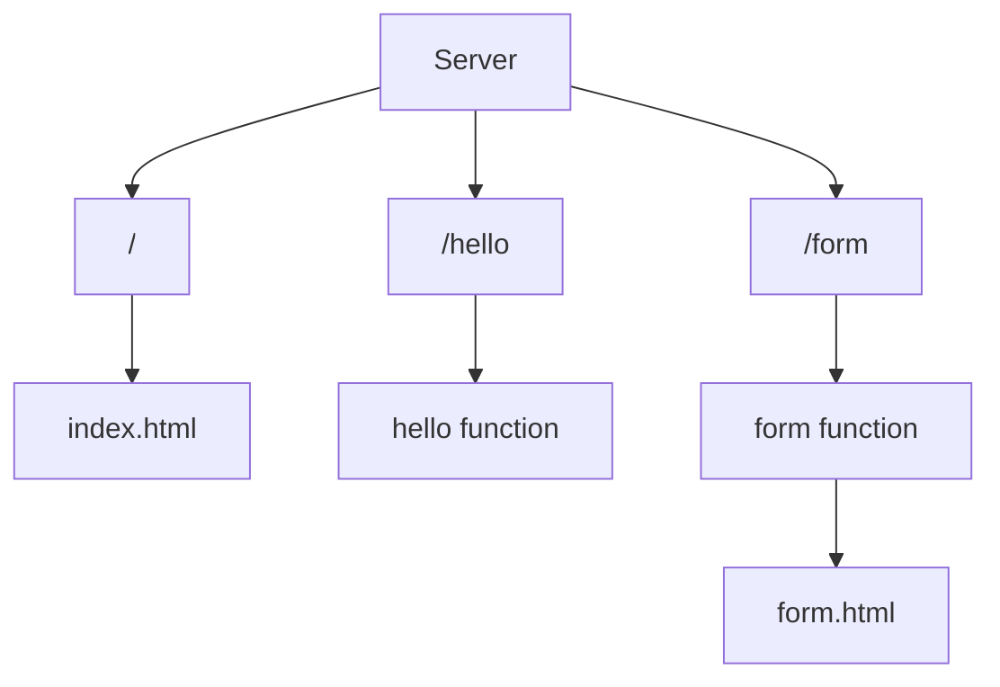

# Simple Web Server in Go

This project serves as an introduction to the `net/http` package. It demonstrates a simple file server with a static HTML website.

## Routes



## How to Run

To execute this project, you need to have [**Go (Golang)**](https://golang.org/) installed on your system.

1. Build the project:
   ```bash
   go build
   ```
2. Run the executable:
   ```bash
   ./go-simple-webserver
   ```
