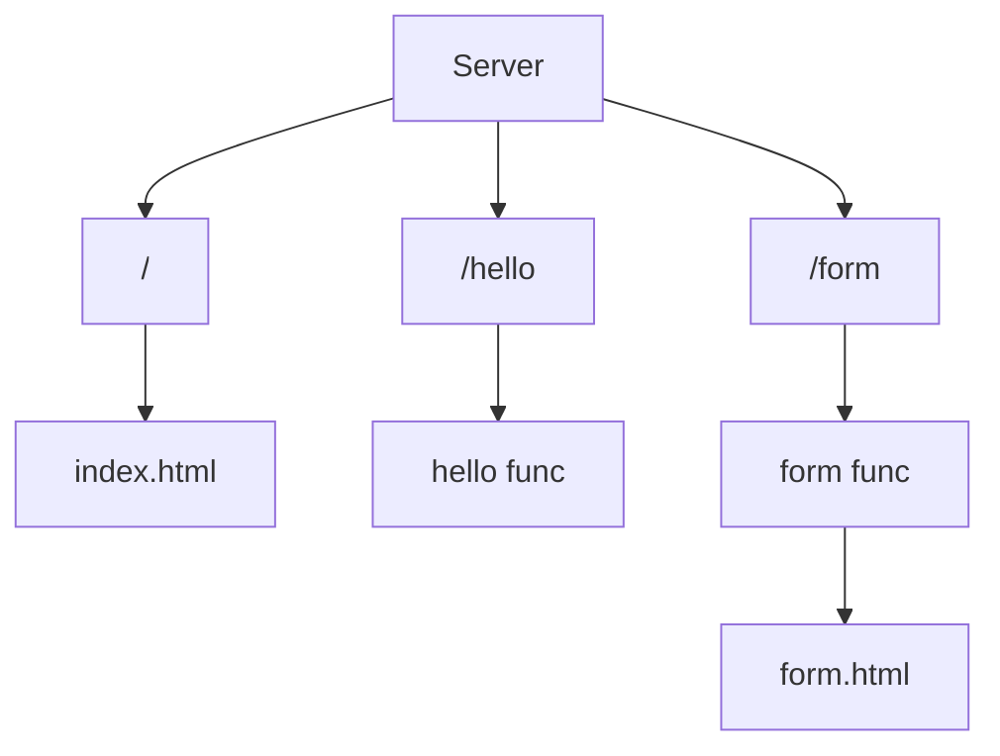

# Simple web server in go

This project is an introducing to the net/http package, is simple little file serve with html static website.

## Routes



## Run

To execute it you must have [**golang**](https://golang.org/)

```
go build
./go-simple-webserver
```
